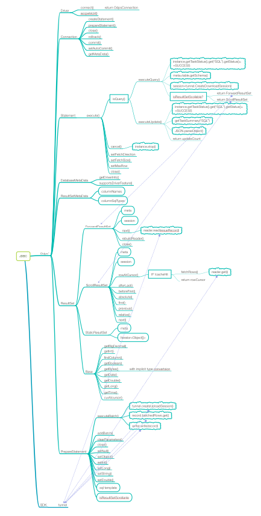

# ODPS JDBC


[](https://maven-badges.herokuapp.com/maven-central/com.aliyun.odps/odps-jdbc)


## Chinese Docs

[MaxCompute JDBC介绍](https://help.aliyun.com/document_detail/143408.html)

## Installation

Generally, there are two ways to use ODPS JDBC driver in your project.

1.The first one is to use the standalone library:

* Download the with-dependencies-jar from [release page](https://github.com/aliyun/aliyun-odps-jdbc/releases).
* Checkout the [CHANGELOG](https://github.com/aliyun/aliyun-odps-jdbc/blob/master/CHANGELOG.md).

2.The second is to rely on maven to resolve the dependencies for you:

```xml
<dependency>
  <groupId>com.aliyun.odps</groupId>
  <artifactId>odps-jdbc</artifactId>
  <version>VERSION</version>
</dependency>
```

## Getting Started

Using ODPS JDBC driver is just as using other JDBC drivers. It contains the following few steps:

1\. Explictly load the ODPS JDBC driver using `Class.forName()`:

```java
Class.forName("com.aliyun.odps.jdbc.OdpsDriver");
```


2\. Connect to the ODPS by creating a `Connection` object with the JDBC driver:


```java
Connection conn = DriverManager.getConnection(url, accessId, accessKey);
```

The ODPS server works with RESTful API, so the url looks like:

```java
String url = "jdbc:odps:ENDPOINT?project=PROJECT_NAME&charset=UTF-8";
```

The connection properties can also be passed through `Properties`. For example:

```java
Properties config = new Properties();
config.put("access_id", "...");
config.put("access_key", "...");
config.put("project_name", "...");
config.put("charset", "...");
Connection conn = DriverManager.getConnection("jdbc:odps:<endpoint>", config);
```


3\. Submit SQL to ODPS by creating `Statement` object and using its `executeQuery()` method:

```java
Statement stmt = conn.createStatement();
ResultSet rs = stmt.executeQuery("SELECT foo FROM bar");
```

4\. Process the result set.

For example:

```java
while (rs.next()) {
    ...
}
```


### Connection String Parameters
It is recommended that the key and value in URL should be encoded by using java.net.URLEncoder#encode(java.lang.String). 

#### Basic

|   URL key        |  Property Key     | Required | Default value | Description                              |
| :--------------: | :---------------: | :------: | :-----------: | :--------------------------------------- |
| `endpoint`       | `end_point`       | True     |               | The endpoint of your MaxCompute service  |
| `project`        | `project_name`    | True     |               | The name of your MaxCompute project      |
| `accessId`       | `access_id`       | True     |               | Your Alibaba Cloud access key ID         |
| `accessKey`      | `access_key`      | True     |               | Your Alibaba Cloud access key secret     |
| `interactiveMode`| `interactive_mode`| False    | false         | For MCQA, enable MCQA                    |
| `logview`        | `logview_host`    | False    | Provided by MC | The endpoint of MaxCompute Logview       |
| `tunnelEndpoint` | `tunnel_endpoint` | False    | Provided by MC | The endpoint of the MaxCompute Tunnel service |
| `enableOdpsLogger` | `enable_odps_logger` | False | false       | Enable MaxCompute JDBC logger          |

#### Advanced
|   URL key        |  Property Key     | Required | Default value | Description                              |
| :--------------: | :---------------: | :------: | :-----------: | :--------------------------------------- |
| `stsToken`       | `sts_token`       | False    |               | The Alibaba Cloud STS token              |
| `logConfFile`    | `log_conf_file`   | False    |               | The configuration path for SLF4J         |
| `charset`        | `charset`         | False    | UTF-8         | The charset of the inputs and outputs    |
| `executeProject` | `execute_project_name` | False |             | For MCQA, the name of the MaxCompute project in which actually execute the queries |
| `alwaysFallback` | `always_fallback` | False    | false         | For MCQA, fall back to regular mode if any exception happened |
| `instanceTunnelMaxRecord` | `instance_tunnel_max_record` | False | -1 (unlimited) | For MCQA, max number of records within a result set, enableLimit option should set to false |
| `instanceTunnelMaxSize`| `instance_tunnel_max_size` | False | -1 (unlimited) | For MCQA, max size of a result set in byte |
| `enableLimit`| `enable_limit` | False | true(limited) | For MCQA, download permission won't be checked if enableLimit is set true, but your result record count will be limited to 10000 |
| `autoLimitFallback`| `auto_limit_fallback` | False | False(no auto fallback) | For non-MCQA mode, result record count will be limited to 10000 when no download permission exception happened and autoLimitFallback is set to true |

## Example

### JDBC Client Sample Code

```java
import java.sql.SQLException;
import java.sql.Connection;
import java.sql.ResultSet;
import java.sql.Statement;
import java.sql.DriverManager;

public class OdpsJdbcClient {
  private static String driverName = "com.aliyun.odps.jdbc.OdpsDriver";

  /**
   * @param args
   * @throws SQLException
   */
  public static void main(String[] args) throws SQLException {
    try {
      Class.forName(driverName);
    } catch (ClassNotFoundException e) {
      e.printStackTrace();
      System.exit(1);
    }

    // fill in the information here
    String accessId = "your_access_id";
    String accessKey = "your_access_key";
    Connection conn = DriverManager.getConnection("jdbc:odps:https://service.odps.aliyun.com/api?project=<your_project_name>", accessId, accessKey);
    Statement stmt = conn.createStatement();
    String tableName = "testOdpsDriverTable";
    stmt.execute("drop table if exists " + tableName);
    stmt.execute("create table " + tableName + " (key int, value string)");

    String sql;
    ResultSet rs;

    // insert a record
    sql = String.format("insert into table %s select 24 key, 'hours' value from (select count(1) from %s) a", tableName, tableName);
    System.out.println("Running: " + sql);
    int count = stmt.executeUpdate(sql);
    System.out.println("updated records: " + count);

    // select * query
    sql = "select * from " + tableName;
    System.out.println("Running: " + sql);
    rs = stmt.executeQuery(sql);
    while (rs.next()) {
      System.out.println(String.valueOf(rs.getInt(1)) + "\t" + rs.getString(2));
    }

    // regular query
    sql = "select count(1) from " + tableName;
    System.out.println("Running: " + sql);
    rs = stmt.executeQuery(sql);
    while (rs.next()) {
      System.out.println(rs.getString(1));
    }

    // do not forget to close
    stmt.close();
    conn.close();
  }
}
```

### Running the JDBC Sample Code

```shell
# compile the client code
mvn clean package -DskipTests

# run the program with specifying the class path
# using prepared shell script (linux)
./jdbc_test.sh 'jdbc:odps:http://service.odps.aliyun.com/api?project=odpsdemo&accessId=...&accessKey=...&charset=UTF-8&logconffile=logback/logback.xml' 'select * from dual'

# using java command
java -cp "target/odps-jdbc-2.2-jar-with-dependencies.jar:logback/logback-core-1.2.3.jar:logback/logback-classic-1.2.3.jar" com.aliyun.odps.jdbc.JdbcTest "jdbc:odps:http://service.odps.aliyun.com/api?project=odpsdemo&accessId=...&accessKey=...&charset=UTF-8&logconffile=logback/logback.xml" "select * from dual"
```

### Setting SQL task properties

```java
stmt.execute("set biz_id=xxxxxx");
stmt.execute("set odps.sql.mapper.split.size=512");
```

## Third-party Integration

It is also recommended to use ODPS by using other third-party BI tools or DB visualizer that supports JDBC.

For example:

* [SQLWorkbench/J]()
* [Squrriel SQL]()
* [Pentaho]()


## Getting Involved

The project is under construction (and not fully JDBC-compliant). If you dicover any good features which have not been implemented, please fire me an [Email](mailto:yichao.cheng@alibaba-inc.com) or just pull a request.

### Architecture

[](mindmap.pdf)

### Build and run unitest

1.Build from source locally:

```
git clone ....
cd odps-jdbc
mvn package -DskipTests
```

2.Copy out a configuration file:

```
cp ./src/test/resources/conf.properties.example ./src/test/resources/conf.properties
```

3.Fill in your connection strings:

```
access_id=...
access_key=...
end_point=...
project_name=...
logview_host=...
charset=UTF-8
```

4.Run maven test command (or just test it in IntelliJ IDEA):

```
mvn test
```

### Data Type Mapping

Currently, 13 ODPS data types are supported. Please see the following table for supported ODPS data 
types and corresponding JDBC interfaces.


| ODPS Type | JDBC Interface                    |   JDBC Type |
| :-------: | :-------------------------------: | :-------:   |
|  TINYINT  | java.sql.ResultSet.getByte        |  TINYINT    |
|  SMALLINT | java.sql.ResultSet.getShort       |  SMALLINT   |
|  INT      | java.sql.ResultSet.getInt         |  INTEGER    |
|  BIGINT   | java.sql.ResultSet.getLong        |  BIGINT     |
|  FLOAT    | java.sql.ResultSet.getFloat       |  FLOAT      |
|  DOUBLE   | java.sql.ResultSet.getDouble      |  DOUBLE     |
|  BOOLEAN  | java.sql.ResultSet.getBoolean     |  BOOLEAN    |
|  DATETIME | java.sql.ResultSet.getTimestamp   |  TIMESTAMP  |
|  TIMESTAMP| java.sql.ResultSet.getTimestamp   |  TIMESTAMP  |
|  VARCHAR  | java.sql.ResultSet.getString      |  VARCHAR    |
|  STRING   | java.sql.ResultSet.getString      |  VARCHAR    |
|  DECIMAL  | java.sql.ResultSet.getBigDecimal  |  DECIMAL    |
|  BINARY   | java.sql.ResultSet.getBytes       |  BINARY     |

NOTE: Possible timezone issue

DATETIME in MaxCompute is actually defined as EPOCH in milliseconds, which is UTC, and so is 
TIMESTAMP in JDBC. This driver fill the DATETIME value directly into JDBC TIMESTAMP and do no parse 
or format action. When application that using JDBC display a DATETIME as a human-readable string 
format, it is the application itself did the format using application defined or OS defined 
timezone. It is suggested to keep your application/OS timezone setting same to MaxCompute to avoid 
inconsistent datetime parse/format.

### Type Conversion

Implicit type conversion happens when accessing a ODPS data type with JDBC interfaces other than the
recommended one. Please see the following table for supported implicit conversions.


| JAVA\ODPS  |TINYINT |SMALLINT|INT      |BIGINT    |FLOAT   |DOUBLE   |DECIMAL  |VARCHAR  |STRING   |DATETIME |TIMESTAMP|BOOLEAN  |BINARY   |
| :--------: | :----: | :----: | :-----: | :------: | :----: | :-----: | :-----: | :-----: | :-----: | :-----: | :-----: | :-----: | :-----: |
|    byte    |   Y    |   Y    |    Y    |    Y     |   Y    |    Y    |    Y    |         |         |         |         |         |         |
|   short    |   Y    |   Y    |    Y    |    Y     |   Y    |    Y    |    Y    |         |    Y    |         |         |         |         |
|    int     |   Y    |   Y    |    Y    |    Y     |   Y    |    Y    |    Y    |         |    Y    |         |         |         |         |
|    long    |   Y    |   Y    |    Y    |    Y     |   Y    |    Y    |    Y    |         |    Y    |         |         |         |         |
|   float    |   Y    |   Y    |    Y    |    Y     |   Y    |    Y    |    Y    |         |    Y    |         |         |         |         |
|   double   |   Y    |   Y    |    Y    |    Y     |   Y    |    Y    |    Y    |         |    Y    |         |         |         |         |
| BigDecimal |        |        |         |          |        |         |    Y    |         |         |         |         |         |         |
|   String   |   Y    |   Y    |    Y    |    Y     |   Y    |    Y    |    Y    |    Y    |    Y    |    Y    |    Y    |    Y    |         |
|  byte\[\]  |   Y    |   Y    |    Y    |    Y     |   Y    |    Y    |    Y    |    Y    |    Y    |    Y    |    Y    |    Y    |    Y    |
|    Date    |        |        |         |          |        |         |         |         |    Y    |    Y    |    Y    |         |         |
|    Time    |        |        |         |          |        |         |         |         |    Y    |    Y    |    Y    |         |         |
| Timestamp  |        |        |         |          |        |         |         |         |    Y    |    Y    |    Y    |         |         |
|  boolean   |   Y    |   Y    |    Y    |    Y     |   Y    |    Y    |    Y    |         |    Y    |         |         |    Y    |         |

## MaxCompute Service Compatibility and Recommended JDBC version

Since Sprint27, MaxCompute tunnel service supported a feature named instance tunnel that allowing client read query result set through tunnel endpoint, to release client from creating temporary table. And this JDBC driver began adopt using instance tunnel since version 2.0.

However, for users using MaxCompute deploy that is earlier than Sprint27 (especially Private Cloud cases), please stick to the latest version before 2.0.

| MaxCompute | JDBC |
| :--------: | :---: |
| Public Service | latest |
| Non PRC Public Service | latest |
| <= Sprint27 | 1.9.2 |

## Authors && Contributors

- [Cheng Yichao](https://github.com/onesuper)
- [Li Ruibo](https://github.com/lyman)
- [Zhao Zhenyi](https://github.com/emerson-zhao)
- [Wen Shaojin](https://github.com/wenshao)
- [Wang Zhong](https://github.com/cornmonster)

## License

licensed under the [Apache License 2.0](https://www.apache.org/licenses/LICENSE-2.0.html)
